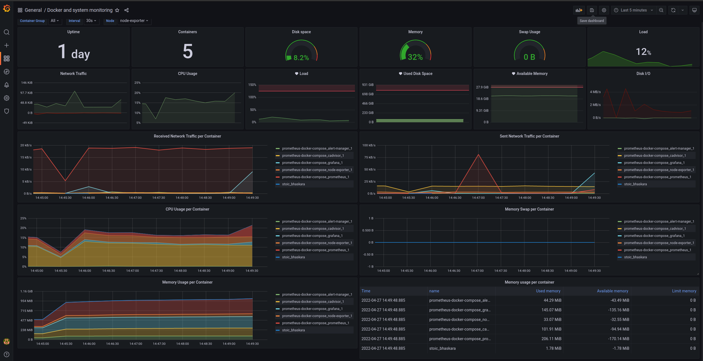
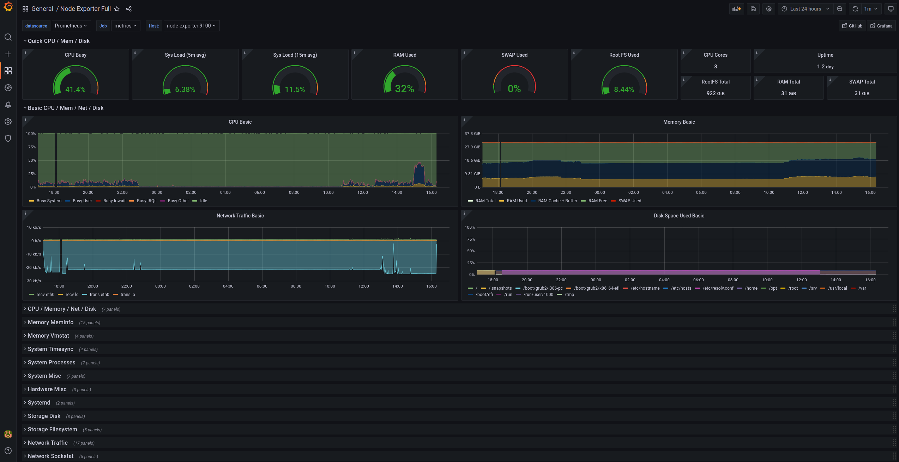

# Docker host monitoring && alerting

Project's purpose is to enable a quick way to monitor and get alerted,when installed on a host with containers.
It will gather metrics about host and containers running inside of it and will create alerts for common scenarios.
Check the file [`alert_rules.yml`](./prometheus/alert_rules.yml) for details.

## Repository overview

```
├── alertmanager
│   └── config.yml
├── docker-compose.yml
├── grafana
│   ├── grafana.ini
│   └── provisioning
│       ├── dashboards
│       │   ├── dashboard.json
│       │   ├── dashboard.yaml
│       │   └── node-exporter.json
│       └── datasources
│           └── datasources.yml
├── images
│   ├── grafana_screen1.png
│   └── grafana_screen2.png
├── prometheus
│   ├── alert_rules.yml
│   └── prometheus.yml
└── README.md
```

## Running the stack
Configuration steps:
1) Edit [`alertmanager/config.yml`](./alertmanager/config.yml) and set your slack hook url and channel like below:
   ```
   receivers:
     - name: "slack"
       slack_configs:
         - api_url: 'https://yourslackhookurl.whatever/cddsfasfdas/adsfafdaf/aasdfafddafa' <- Set this to your slack hook url
           send_resolved: true
           channel: 'somechannel' <- Set this to your channel of preferance to recieve the alerts
   ```
2) Change the default admin password at [`.env`](.env) like below:
   ```
   ADMIN_PASSWORD  <- Change this to something safer :)
   ```

3) Change `mydomain` at [`.env`](.env) with your host ip OR your host domain name.
   ```
   PROJECT_DOMAIN=host(`mydomain`)
   SERVER_DOMAIN=mydomain
   ```

4) OPTIONAL: Enable Lets-Encrypt certificate. (HTTPS is already enabled)
   Uncomment below lines in [`docker-compose.yml`](docker-compose.yml)
   ```
   At traefik service:
   #- traefik-data:/letsencrypt/
   #- "--certificatesResolvers.le-ssl.acme.tlsChallenge=true"
   #- "--certificatesResolvers.le-ssl.acme.email=${PROJECT_EMAIL_ADDRESS}"
   #- "--certificatesResolvers.le-ssl.acme.storage=/letsencrypt/acme.json"
   At grafana service:
   #- "traefik.http.routers.grafana-ssl.tls.certResolver=le-ssl"
   At volumes section:
   #traefik-data: {}
   ```
   also set an email for Lets-Encrypt at [`.env`](.env)
   ```
   PROJECT_EMAIL_ADDRESS
   ```

5) Run the below command at the project root directory:
`docker-compose up -d`
  *You may need sudo for above command if your user is not in docker group.*


6) Now you can go to:
`https://${SERVER_DOMAIN}` to login to grafana with the values you have set at [`.env`](.env)


## Pictures
Main dashboard:


Node-exporter dashboard:


## More resources

[Grafana docs](https://grafana.com/docs/grafana/latest/administration/configuration/)
[Prometheus docs](https://prometheus.io/docs)
[Docker docs](https://docs.docker.com/)
[Traefik docs](https://doc.traefik.io/traefik/)
